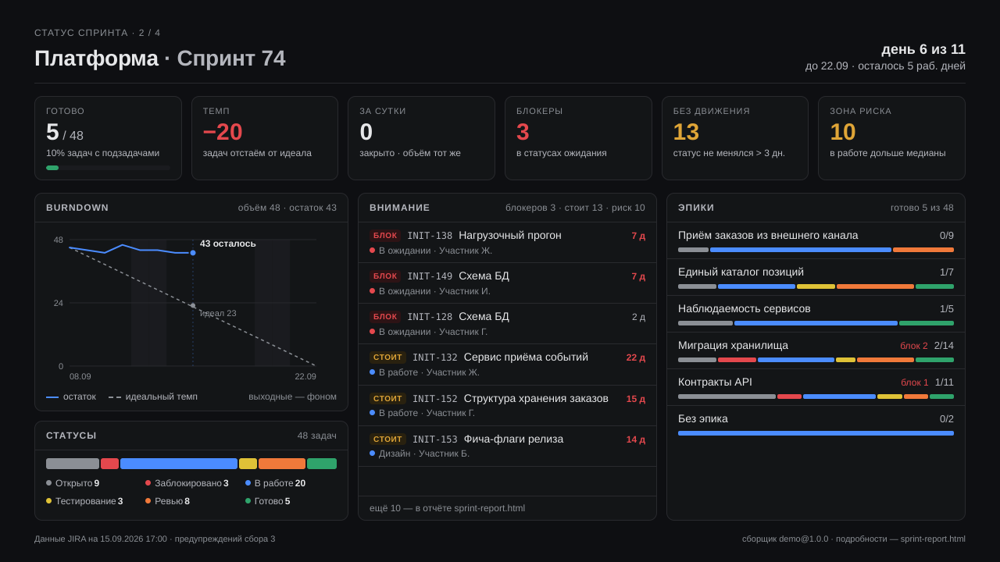
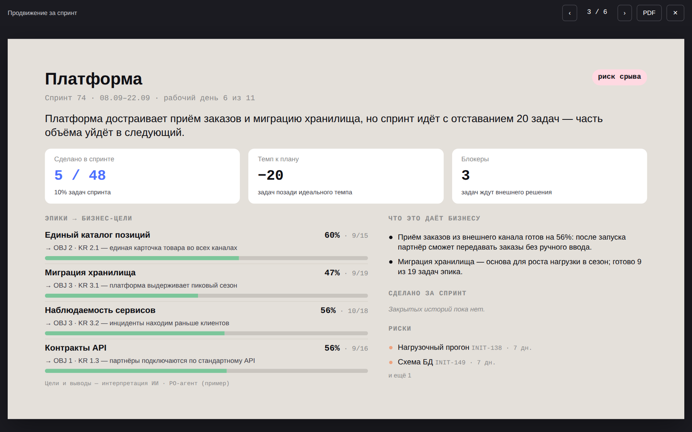
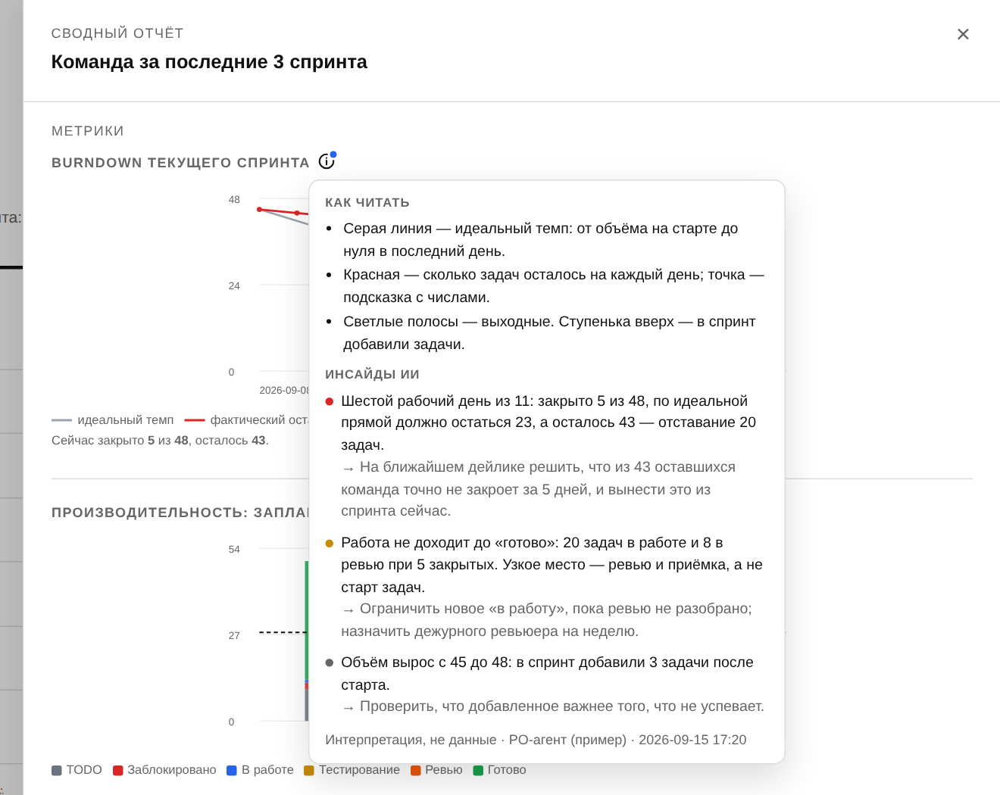

# poh-sprint-agents

Агенты вокруг спринта: планирование до его начала и факт по ходу.

- **`sprint-planner`** — спринт → согласованный vault-ПЛАН, операционный контракт и гейт консенсуса команды.
- **`actual-sprint`** — текущий спринт → самодостаточная HTML-страница отчёта: эпики со статусами, метрики за три спринта, лента активности.
- **`sprint-status`** — статус спринта одним PDF в чат: лист на команду в стиле слайдов `/morning` — KPI, burndown, статусы, блокеры и зависшее, эпики. Годится для рассылки по расписанию.
- **`sprint-insights`** — инсайды ИИ для PO: на что обратить внимание в спринте и что можно сказать о команде и тенденции. Агент интерпретирует факты, которые скрипт достал из снимка; скрипт проверяет и встраивает их в страницу. Данные по-прежнему собирает только скрипт.

## Установка

```bash
bash install.sh [target-проект]
```

Копирует навыки и команды (non-destructive, существующее не перезаписывает), кладёт `.claude/domain-profile.md` из шаблона.

Для `actual-sprint` нужен доступ к JIRA:

```bash
export JIRA_PERSONAL_TOKEN=…
export JIRA_URL=https://jira.example.com   # хост вашего инстанса
```

Токен живёт только в окружении: ни в конфиг, ни в lock-файл, ни на страницу он не попадает.

## Команды

### Планирование (STOP после каждой)

`/sm-sync` → `/sm-goal` → `/sm-decompose` → `/sm-load` → `/sm-deliver` → `/sm-consensus`

### Факт спринта

`/sprint-setup` → `/collector-new {slug}` (если нужно) → `/collector-validate {slug}` → `/actual-sprint {команда?}`

`/actual-sprint` запускает runner и показывает сводку; страница одна на все команды — переключатель вкладок в шапке. Первые три команды — настройка, они нужны один раз на команду.

Что на странице:

- **Таблица эпиков.** Единица отчёта — эпик, не история. В строке счётчики статусов по всей иерархии (истории + подзадачи) вида `2/2/3/0/5/1`, цвет на бакет, расшифровка по наведению. Клик открывает панель: истории спринта с разворотом подзадач, статусом, возрастом статуса и исполнителем; «Смотреть весь эпик» — полный объём эпика, разделённый на «Осталось» (по процессу) и «Сделано». У эпиков, историй и подзадач — приоритет из JIRA.
- **Сводный отчёт за 3 спринта** (клик по Lead Time в шапке): burndown текущего спринта, производительность «запланировано / сделано» с разбивкой планового столбца по статусам, диаграммы управления отдельно по историям и подзадачам — с выбросами и жёлтой зоной риска. Расшифровка — в подсказке «i» у графика, внизу — раздел «Инсайды ИИ» для PO.
- **Презентация** (кнопка справа вверху): второй отчёт из тех же данных — краткая колода «Продвижение за спринт» для управляющего комитета и бизнес-заказчиков: сводка по командам, по слайду на команду (что сделано, эпики → бизнес-цели, риски), что нужно от комитета. Печатается в PDF по слайду на страницу; runner кладёт её ещё отдельным файлом `reports/sprint-business.html`.
- **Телефон и PWA.** Под iPhone: карточки эпиков, панели на весь экран, заметка — долгим нажатием, «i» — по тапу. Открытая по ссылке в Safari страница ставится на экран «Домой» и работает как приложение. Подробнее — в инструкции, раздел «На телефоне».
- **Лента активности** (кнопка «Logs»): смены статусов, комментарии и создание задач за неделю, фильтры по типу и автору.

- **Корзина заметок** справа вверху: заметка — строка текста, при наведении карандаш и мусорка; необязательная привязка к эпику или задаче (правый клик по строке или ключ); «Скопировать промт для ИИ» — вставить в чат агенту.

#### Данные собирают сборщики, а не модель

ИИ пишет и проверяет код сборщика, но никогда сам не собирает данные отчёта. Граница между ними — жёсткий контракт:

```bash
python3 .claude/skills/actual-sprint/runner/run.py run --config sprint-report.config.toml
```

- **Контракт** — `contract/team.schema.json` (форма данных) и `contract/PROTOCOL.md` (как запускается сборщик, что на stdin/stdout, коды выхода).
- **Сборщик** — программа на команду. Базовый шаблон на Python покрывает большинство случаев: все правила команды вынесены в `params` конфига (типы задач, статусы, поле эпика, глубина по спринтам).
- **Runner** — читает конфиг, запускает сборщики, валидирует результат схемой и 12 инвариантами, переносит заметки, собирает HTML.
- **Проверка** — `/collector-validate` сверяет выборку задач с JIRA и фиксирует хеш сборщика в `sprint-report.lock.json`. Изменённый сборщик не запускается, пока проверку не пройдут заново.

Если хотя бы одна команда не собралась, HTML не пишется: прошлый отчёт остаётся целым, а полуправды на странице не появляется. Чем и когда собрана каждая команда, runner печатает в сводке; то же лежит в `_meta` данных и в подвале PDF `/sprint-status`.

**Сайдкары и `merge`.** Каждая успешно собранная команда сохраняется отдельно — `reports/teams/<slug>.json` (последний валидный сбор; у упавшей команды остаётся прошлый). Страницу из сайдкаров собирает `merge`, без похода в JIRA:

```bash
python3 .claude/skills/actual-sprint/runner/run.py run --only team-a        # обновить одну команду
python3 .claude/skills/actual-sprint/runner/run.py merge team-a team-b      # страница из сайдкаров
```

`merge` перевалидирует каждый сайдкар (схема + инварианты), отвергает сайдкары старше `--stale-hours` (6 ч; `--stale-ok` — принять с пометкой) и, как `run`, не пишет HTML, если хоть одна команда не принята. `--workspace` (повторяемый) ищет сайдкары в других проектах — сводная страница нескольких workspace'ов.

Python 3.9+, без зависимостей. Конфиг проекта — TOML (на 3.11+ его читает `tomllib` из stdlib, на 3.9–3.10 — мини-парсер `runner/mini_toml.py`):

```toml
version = 1
[[teams]]
slug = "team-a"
name = "Команда A"
board = 101
collector = "base"
[teams.params]
story_types = ["История", "История Enabler", "Story"]
```

Полный образец — `.claude/skills/actual-sprint/examples/sprint-report.config.toml`.

Только чтение JIRA, ничего не публикует. Проверка TLS включена всегда; корпоративный CA подключается через `jira.ca_bundle`.

Тесты идут без сети, на записанных ответах JIRA:

```bash
python3 -m unittest discover tests
cd tests/e2e && npm install && npm test   # страница в Chromium: десктоп и iPhone 15 Pro (касания, PWA)
```

### Статус спринта в PDF

`/sprint-status {команда?}` — те же данные, что на странице, одним PDF: лист на команду (темп против идеальной прямой, что закрыли за сутки, блокеры и задачи без движения, зона риска, burndown, статусы, эпики) и сводный лист, если команд несколько. Лист собирает `status.py` из снимка `reports/sprint-report.data.json`, который runner пишет вместе с HTML. Печатает headless Chrome/Chromium; модель только передаёт файл.



```bash
python3 .claude/skills/sprint-status/status.py --refresh   # пересобрать данные и PDF
python3 .claude/skills/sprint-status/status.py             # PDF из последнего снимка, без JIRA
```

По расписанию в Hermes Agent — cron без модели: stdout с меткой `MEDIA:` уходит в чат, PDF — вложением:

```bash
cp .claude/skills/sprint-status/hermes/sprint-status.sh "$HERMES_HOME/scripts/"
hermes cron create "45 9 * * 1-5" --no-agent --script sprint-status.sh --name sprint-status --deliver telegram
```

📋 **[Инструкция по /sprint-status](docs/sprint-status-guide.md)** — что означает каждый блок, печать, настройка Hermes.

### Презентация для управляющего комитета

Отчёт PO нужен для синхронизации с техлидами и уточняющих вопросов. Комитету, PO смежных департаментов и бизнес-заказчикам нужно другое — коротко, что команды продвинули за спринт и каким бизнес-целям это служит. Кнопка «Презентация» в отчёте открывает такую колоду из тех же данных, а runner пишет её ещё отдельным файлом `reports/sprint-business.html` — его и отправляют.

Слайды: титул → «Как идут команды» → по слайду на команду → «Что нужно от комитета». Цифры — из данных сбора, те же, что в отчёте и в PDF `/sprint-status`. Связь «эпик → цель», «что это даёт бизнесу» и просьбы к комитету пишет агент в бизнес-блоке `/sprint-insights` — цели только из OKR/roadmap PO; нет их — на слайде «цель не указана». Стиль — брендбук колоды экватора квартала (`poh-okr-agent`). Кнопка «PDF» печатает по слайду на страницу 16:9.



### Инсайды ИИ для PO

`/sprint-insights {команда?}` — второй, отдельный конвейер. Данные собирает скрипт; что из них следует — на что обратить внимание PO, в каком состоянии команда и куда идёт тенденция — пишет агент, а скрипт держит его в рамках:

```bash
python3 .claude/skills/sprint-insights/insights.py facts   # факты из снимка → агенту
# агент пишет reports/sprint-insights.json (форма — contract/insights.schema.json)
python3 .claude/skills/sprint-insights/insights.py apply   # проверка + страница из снимка, без JIRA
```

`apply` не пускает на страницу ключи задач, которых нет в данных, и наблюдения, написанные по другому сбору (хеш данных), а числа, которых нет в фактах, помечает. На странице — раздел «Инсайды ИИ» внизу сводного отчёта, с пометкой «Интерпретация ИИ, не данные».



🛠 **[Отладка на реальном инстансе](docs/actual-sprint-debug.md)** — `doctor`, таблица отказов (VPN, токен, корпоративный CA, чужие статусы), record/replay.

📖 **[Полная инструкция](docs/actual-sprint-guide.md)** — как запускать, что означает каждая метрика, как найти доску команды, что делать, если собралось не то.

## Документы

- Инструкция по `/actual-sprint`: `docs/actual-sprint-guide.md`
- Инструкция по `/sprint-status`: `docs/sprint-status-guide.md`
- Навык `/sprint-insights`: `.claude/skills/sprint-insights/SKILL.md`
- Отладка на реальном инстансе: `docs/actual-sprint-debug.md`
- Видение: `VISION.md`
- Эталон разбора квартала (куда должны прийти по итогам ретро): `docs/quarter-retro/TARGET.md`, страница — `docs/quarter-retro/ideal_quarter_fact.html`
- БФТ `sprint-planner`: `docs/bft-sprint-planner-slice1.md`
- Дизайн `sprint-planner`: `docs/superpowers/specs/2026-07-17-sprint-planner-slice1-design.md`
- Внутренняя документация навыка, всё в `.claude/skills/actual-sprint/`:
  - `SKILL.md` — стадии и дизайн-контракт страницы
  - `contract/team.schema.json` — форма объекта команды (источник истины)
  - `contract/PROTOCOL.md` — протокол сборщика
  - `contract/status_rules.json` — правила бакетов данными
  - `runner/run.py` — `run | validate | lock | new`
  - `templates/python/collector.py` — базовый сборщик, правила в `params`
  - `resources/metrics.md` — что именно считается и почему
  - `resources/status_mapping.md` — раскладка статусов JIRA по шести бакетам
  - `resources/data_collection.md` — алгоритм запросов, документация для авторов сборщиков
  - `resources/data_shape.md` — почему форма данных такая
  - `scripts/demo_data.py` — демо-страница без похода в трекер
