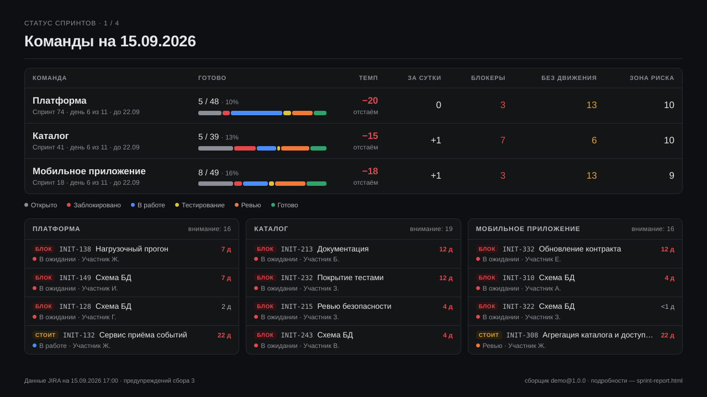

# /sprint-status — статус спринта одним PDF

Один файл в чат: лист на команду в визуальном языке утренних слайдов `/morning` (poh-morning-status). Если команд несколько, первым идёт сводный лист. Цифры те же, что на HTML-странице `/actual-sprint`. Лист целиком собирает скрипт, а не модель, поэтому форма каждый раз одна и та же.




Демо без JIRA:

```bash
python3 .claude/skills/actual-sprint/scripts/demo_data.py --out demo.json
python3 .claude/skills/sprint-status/status.py --data demo.json --out demo/sprint-status.pdf
```

## Что на листе

| Блок | Как считается |
|---|---|
| **Шапка** | команда · спринт; рабочий день N из M (без суббот и воскресений) и срок. «Срок истёк» — дата окончания прошла, а спринт в JIRA ещё активен |
| **Готово X / Y** | задачи спринта с подзадачами, закрытые на сегодня, из объёма на сегодня |
| **Темп** | остаток сегодня минус остаток на идеальной прямой. Прямая идёт от объёма первого дня с задачами до нуля в последний день — та же серая линия, что на burndown страницы |
| **За сутки** | разница burndown сегодня и вчера: сколько закрыли, как изменился объём |
| **Блокеры** | истории и подзадачи эпиков в бакете «Заблокировано» |
| **Без движения** | в работе, тесте или ревью без смены статуса дольше 3 дней — как красный возраст на странице |
| **Зона риска** | задачи **этого** спринта, которые идут дольше медианы Cycle Time своей группы. На странице график показывает три спринта, здесь хвосты прошлых отброшены |
| **Burndown** | остаток по дням (синий), идеальный темп (пунктир), выходные фоном, подписи «осталось» и «идеал» на сегодня |
| **Статусы** | шесть бакетов по всем задачам спринта; раскладка — `actual-sprint/resources/status_mapping.md` |
| **Внимание** | блокеры → без движения → зона риска, без повторов, самые долгие первыми; до 6 строк, остальное числом |
| **Эпики** | готово/всего по всей иерархии эпика, полоса статусов, число блокеров; «Без эпика» последней строкой |
| **Подвал** | когда собраны данные и каким сборщиком. Старше 12 часов — пометка ⚠ (`--max-age`) |

Сводный лист: таблица команд (готово, темп, за сутки, блокеры, без движения, зона риска) и по четыре самые острые задачи каждой команды. Больше трёх команд — только таблица.

Цвета статусов — те же шесть, что на странице `/actual-sprint`, осветлённые под тёмный фон. Контраст и различимость соседних цветов проверены валидатором палитры. У пары «тестирование / ревью» различимость для дальтоников пограничная, поэтому на листе цвет никогда не работает один: рядом всегда есть подпись.

## Откуда данные

`/actual-sprint` (runner) при каждой успешной сборке пишет рядом со страницей снимок `reports/sprint-report.data.json` — тот же массив команд, что уходит в HTML. `/sprint-status` читает его:

- `status.py` — за секунды, без обращения к JIRA;
- `status.py --refresh` — сначала пересобирает отчёт runner'ом (страница тоже обновится), потом PDF.

Если сбор не удался (нет VPN, токен просрочен, сборщик не проверен), скрипт не молчит и не падает. PDF собирается из последнего снимка с жёлтой плашкой причины на каждом листе, а первая строка сообщения — `⚠ Свежий сбор не удался: <причина>`. Путь к снимку задаёт ключ `data` в `sprint-report.config.toml`.

Результат лежит в `reports/`: `sprint-status-<дата>.pdf` и `.html` рядом (тот же лист, удобно для отладки макета). `--out` задаёт другой путь, `--team <slug>` — одна команда (`sprint-status-<slug>-<дата>.pdf`).

## Печать в PDF

HTML печатает headless Chrome/Chromium, Python-зависимостей нет. Браузер ищется так:

1. `--chrome <путь>` или переменная `SPRINT_STATUS_CHROME` / `CHROME_PATH`;
2. Chromium из `PLAYWRIGHT_BROWSERS_PATH` (например, тот, что ставит `tools/mts-link-sync` в poh-morning-status);
3. Google Chrome, Chromium, Edge или Brave в стандартных местах и в `PATH`.

Браузера нет → `Статус спринта не собран: PDF не собран: нет Chrome/Chromium…`, а лист остаётся в `.html`. Без браузера можно собрать только HTML: `--html-only`.

## Что уходит в чат

stdout — готовое сообщение:

```
Статус спринта на 15.09 17:00 — Платформа, Каталог, Мобильное приложение
MEDIA:/…/reports/sprint-status-2026-09-15.pdf
```

По метке `MEDIA:` Hermes прикладывает файл: в Telegram PDF приходит документом. Лог runner'а и печати уходит в stderr и в чат не попадает.

## По расписанию в Hermes Agent

### Вариант 1 (рекомендуется): cron без модели

В режиме `--no-agent` Hermes запускает скрипт и отправляет его stdout без LLM. Метку `MEDIA:` он разбирает и в этом режиме: вся доставка cron идёт через `extract_media`.

```bash
cp .claude/skills/sprint-status/hermes/sprint-status.sh "$HERMES_HOME/scripts/"
chmod +x "$HERMES_HOME/scripts/sprint-status.sh"

hermes cron create "45 9 * * 1-5" --no-agent --script sprint-status.sh \
  --name sprint-status --deliver telegram
```

- `SPRINT_REPORT_PROJECT` — каталог проекта с `sprint-report.config.toml` и установленными навыками. По умолчанию `~/sprint-report`.
- `JIRA_URL` и `JIRA_PERSONAL_TOKEN` должны быть в окружении Hermes. Если их нет, придёт PDF по последнему снимку с пометкой ⚠ и причиной.
- `SPRINT_STATUS_CHROME` — если браузер не находится сам.
- Если в Hermes включён строгий режим вложений (`gateway.strict`), добавьте `reports/` проекта в `gateway.media_delivery_allow_dirs`. По умолчанию свежесозданные файлы пропускаются.
- Hermes оборачивает сообщение cron заголовком «Cronjob Response». Убрать обёртку — `cron.wrap_response: false` в конфиге Hermes.
- Ненулевой код выхода (нет проекта, конфига, снимка или браузера) Hermes доставляет как ошибку; в stdout при этом одна понятная строка.

### Вариант 2: cron с агентом

Если сообщение нужно в сессии PO-агента:

```bash
hermes cron create "45 9 * * 1-5" \
  "Выполни навык sprint-status: запусти status.py --refresh и отправь его stdout без изменений." \
  --skill sprint-status --workdir /path/to/project --deliver telegram
```

Промпт cron-задачи должен быть самодостаточным: у задачи нет памяти прошлых разговоров. Навык запрещает агенту пересказывать лист, но дословность здесь держится на модели, поэтому для ежедневной рассылки лучше вариант 1.

### Вызов в чате

«Статус спринта», «как идёт спринт», `/sprint-status` → агент запускает скрипт и отдаёт его вывод как есть, PDF приходит вложением. Навык ставится вместе с остальными: `bash install.sh <проект>`.

## Связь с /morning

`/morning` — бриф PO по всем каналам, `/sprint-status` — только спринт. Визуальный язык общий (тёмная тема, виджеты, KPI-плитки), поэтому лист спринта читается рядом с утренними слайдами без переключения контекста.
